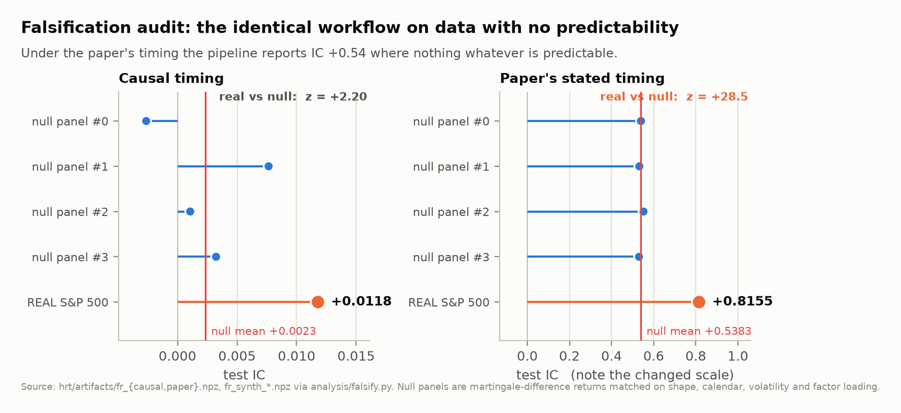
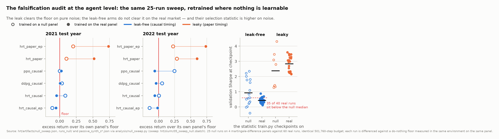
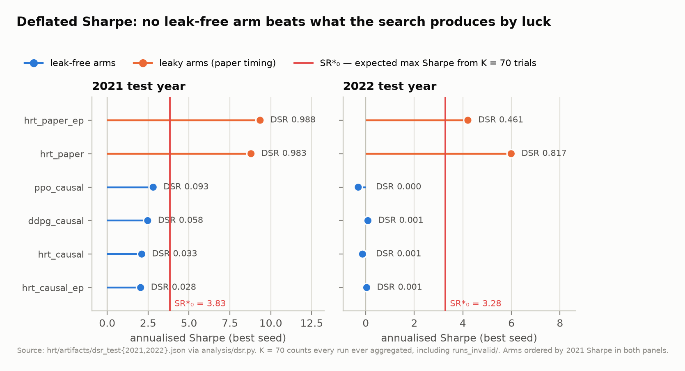
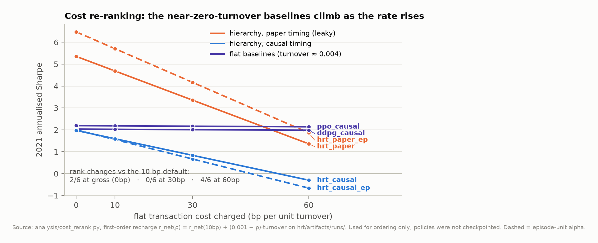
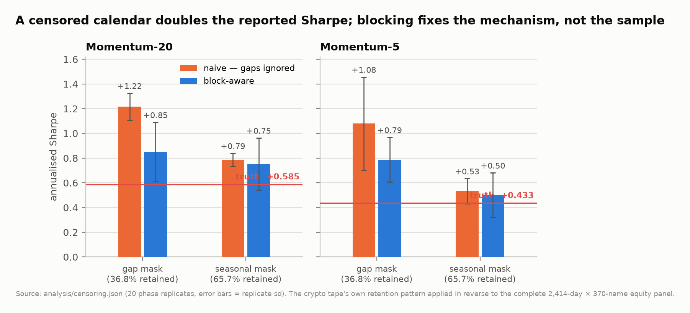
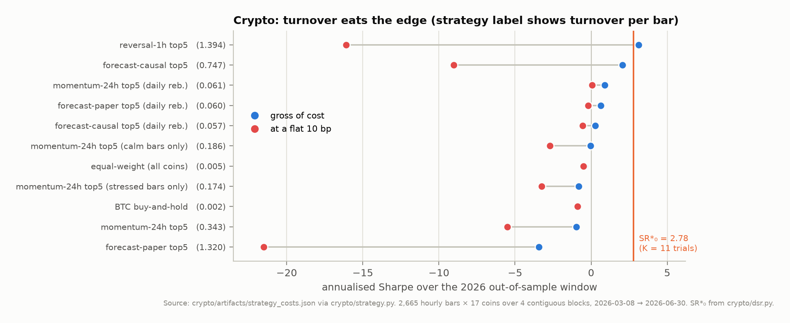
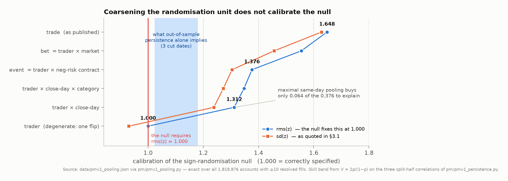
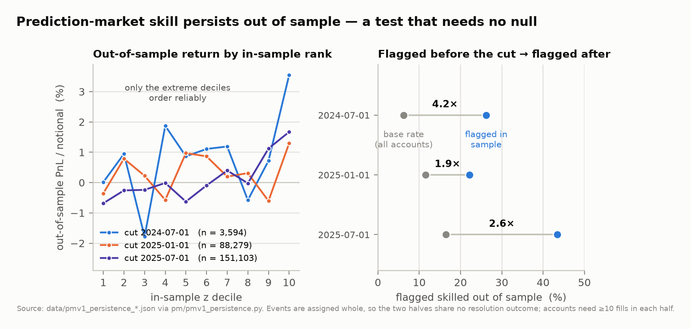
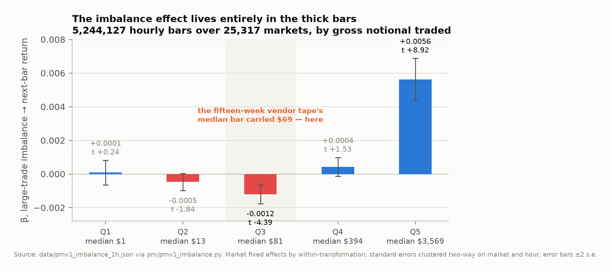
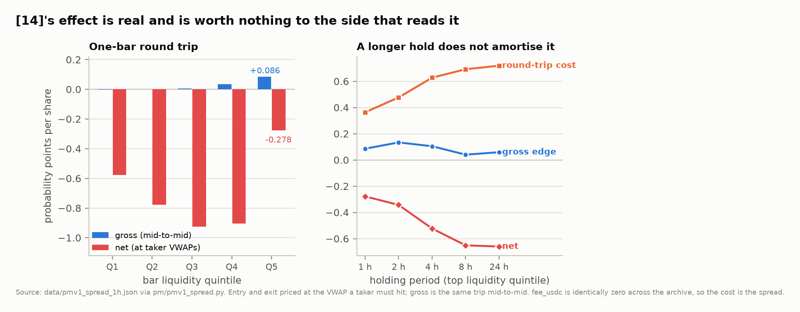

# Evaluation Protocol as the Load-Bearing Variable

### Reproductions in reinforcement-learning trading and prediction markets

**Author.** FYP H398280 · *AI in Financial Data Analytics and Trading*
**Supervisor.** LU Yao
**Status.** Working draft, 14 September 2026. Figures in `figs/`; numbers in
[`RESULTS.md`](RESULTS.md) and [`RAW.md`](RAW.md); bibliography in [`PAPERS.md`](PAPERS.md).

---

## Abstract

We reproduce a recent hierarchical reinforcement-learning trading system (HRT) and four
adjacent empirical claims, and find that in every case the reported result is determined by
the evaluation protocol rather than by the model. Three contributions follow.

First, we run a **falsification audit** in the sense of Nikolopoulos (2026): the complete
pipeline — Alpha158 features, Transformer forecaster, top-30 long book — is re-executed on
synthetic panels whose returns are a martingale difference, so that nothing is predictable
by construction. Under the label timing stated in the paper the pipeline reports a test
information coefficient of **+0.538 on pure noise**, against +0.816 on real data. The
mechanism is identifiable and mechanical: a single same-bar feature (`KMID`) explains
**R² = 0.653** of the label the model is asked to predict. We then extend the audit to the
reinforcement-learning layer, retraining the entire 25-run agent sweep on those same panels
at an identical step budget and scoring each run against a do-nothing floor measured inside
the same environment on the same panel. The leak propagates all the way to the traded book:
agents trained under the paper's timing beat that floor by **+0.15 and +0.26 of book on data
with no predictability**, a quarter to two-fifths of the excess they show on the real
market. The leak-free agents beat it by nothing on the null — and, over ten seeds, by
nothing on the real market either (−0.017, t = −2.16; −0.041, t = −4.79), with the two
hierarchy arms that are the paper's actual contribution below the floor in **both** test
years. The statistic used to checkpoint them is **higher on the null panels than on the real
one**: 35 of 40 real runs fall below the null median.

Second, we show that **no leak-free arm survives deflation**, and that searching harder
makes this worse rather than better. Doubling the sweep from 35 to 70 trials raised the best
observed Sharpe from 6.02 to 8.79 and raised the selection threshold from SR\*₀ = 2.905 to
**3.829**, cutting every leak-free arm's deflated Sharpe by roughly two-thirds. The null
sweep independently calibrates that threshold by direct simulation, agreeing with the
closed form to within 1.30× and 0.99×, and supplies a non-parametric p-value under which no
leak-free arm's best seed reaches p < 0.05. The same correction applied to an independent
crypto sweep clears every strategy gross of cost. Separately, we quantify a data defect that
is invisible in the usual pipeline: applying a vendor tape's own censoring pattern in
reverse to a complete equity panel, a naively concatenated backtest reports Sharpe 1.22
where the truth is 0.59, and 42 % CAGR where the truth is 11 %.

Third, on a 730-million-fill on-chain prediction-market archive we find that the published
sign-randomisation test for trader skill is **mis-calibrated by construction** (rms(z) =
1.65 against a required 1.00 over 1.82 M accounts), that correcting the randomisation unit
is necessary but not sufficient, and — contrary to our own prior conjecture — that the
residual over-dispersion is **not** a pooling artefact but largely the effect itself. We
establish the substantive claim by a route that needs no null at all: skill **persists out
of sample**, with lift 1.9–4.2× at three cut dates. Finally we replicate a large-trade
order-imbalance predictor (t = +13.3) and show that, priced at the prices a taker actually
transacts at, it is **4.2× under its round-trip cost** at every holding period and signal
threshold tested — its entire economic value accrues to the liquidity provider.

Fourth, we ask whether a language model can read a prediction market's own question — the
one setting where text *is* the instrument rather than commentary about it. It cannot, and
asking costs more than the answer. **57 % of the archive's fills trade on slugs containing a
unix timestamp**, and the question text predicts the date a row traded at **R² = 0.920**. So
the split convention decides the result: the same text block is worth **+0.505 of test IC
and a book of +18.56 probability points per share (t = +54.6)** under an i.i.d. row split
and **−0.007** under a walk-forward event split. Under the correct split no encoder — tf-idf,
FinBERT, BERT-base, MiniLM, frozen or fine-tuned — beats a price baseline, and in half the
folds a fair shrinkage search sets the text weight to exactly zero.

The unifying finding is negative and transferable: **of the positive results we tested,
none survived a correctly specified evaluation, and the one non-replication we reversed was
reversed by better data rather than a better model.**

---

## 1. Introduction

Machine-learning trading research has a reproducibility problem that is now documented
rather than alleged. Xia et al. (2026) screen 77 studies and retain 19 on empirical
criteria; of those, **two** report an extractable time-consistent split protocol, **one**
documents a transaction-cost model, **one** addresses survivorship, and **none** reaches
the top rung of their reproducibility ladder, with 15 of 19 at the lowest. Failure to
replicate is the field's modal outcome, and the two things least often reported — cost
modelling and survivorship — are precisely the two that decide whether a reported edge is
real.

This project began as a reproduction of the Hierarchical Reinforced Trader (Zhao & Welsch,
2024), a bi-level system that separates asset selection from order sizing. The reproduction
failed: 2021 +23.1 % / 2022 −7.6 % against a published +39.8 % / +2.3 %, with every RL agent
finishing below a passive floor in the bear year — and, at ten seeds, below it in the bull
year too. A failed reproduction is an anecdote. The work reported here is the attempt to
turn it into a claim.

The organising question is therefore not *does this architecture work?* but **what part of
a reported result is contributed by the evaluation protocol rather than by the model?** We
answer it in five settings — an equity RL sweep, a synthetic-null reference class, an
independent crypto asset class, a vendor data tape with censored coverage, and a
prediction-market trade archive — and the answer is consistently: most of it.

### 1.1 Contributions

1. **A falsification audit of an RL trading pipeline, carried through to the agents**
   (§4). We show the forecaster is falsified under its own stated timing, identify the leak
   to a single named feature, quantify it, and then retrain the whole agent sweep on the
   null reference class to show that the defect survives into the traded book and that the
   checkpointing rule selects on a statistic noise reproduces more strongly than the market
   does. To our knowledge neither has previously been done to HRT.
2. **Deflation applied across two asset classes** (§5.1), with the trial count reported
   honestly, showing that no leak-free result in either sweep exceeds what its own search
   would produce by luck.
3. **A measurement of what censored vendor coverage costs** (§5.3), obtained by applying an
   observed censoring pattern in reverse to a panel where ground truth exists.
4. **A diagnosis and repair of the published prediction-market skill test** (§6.1–6.2),
   including a decomposition that separates estimator mis-specification from genuine
   cross-account heterogeneity without using a null.
5. **A net-of-cost verdict on a replicated order-flow predictor** (§6.3), priced at
   executable prices rather than at last-print marks.

### 1.2 What this paper does not claim

We do not claim HRT's architecture is unsound; we claim its published numbers are not
reproducible under a leak-free reading of its stated timing. We do not claim there is no
alpha in any of these settings; we claim that each edge we could measure was either below
its own selection threshold or below its own transaction cost. And we are explicit about
what the null sweep does and does not establish: the null side is four panels and 25 runs,
so per-arm null statistics are weak, and the real side is a **single panel** — one draw of
market history — so its dispersion is across seeds only (§7.3).

---

## 2. Related work

**Hierarchical RL for trading.** HRT (Zhao & Welsch, 2024) is the direct target. Its
predecessor HRPM (Wang et al., 2020) states the motivating critique in one line — existing
portfolio-RL work "assume[s] each reallocation can be finished immediately and thus ignores
price slippage as part of the trading cost" — and, unlike HRT, runs its two levels at
*different frequencies*. HARLF (Coriat & Benhamou, 2025) extends the hierarchy with
sentiment and reports 26 % annualised over 2018–2024 without a passive floor or a cost
stress test. Kashif & Ślepaczuk (2026) provide the most careful evaluation in this cluster —
sixteen walk-forward folds across three continents — and report that **no configuration
achieves statistically significant excess returns over buy-and-hold across markets**, which
is the closest external corroboration of our own negative result.

Note that HRT exists in two substantially different versions. v1 (Oct 2024) tests 2021/2022
on an S&P 500 universe; v2 (May 2026) switches to an 89-name Nasdaq news benchmark, tests
2020–2023, reports Sharpe rather than raw return (1.06 → 1.24), and adds turnover and
drawdown penalties to the low-level controller. **This paper reproduces v1.** That the
authors independently arrived at turnover control between versions is corroboration of the
failure mode we measure, not a scoop.

**Evaluation and overfitting.** Bailey & López de Prado (2014) give the closed-form
correction for selection bias and non-normality that we apply in §5.1. Arian et al. (2024)
compare out-of-sample protocols in a synthetic environment where false discoveries are
countable, and find combinatorial purged cross-validation markedly superior to walk-forward
— a recommendation we have **not yet implemented** (§8). Nikolopoulos (2026) supplies the
falsification-audit design that is this paper's methodological spine: run the complete
workflow against a reference class with no predictability and treat significant
walk-forward evidence there as falsifying. Li et al. (2026) make a structurally similar
argument for LLM backtests — that a headline number decomposes into a leakage component and
a real component — and report corrections as large as −67.1 %.

**Prediction markets.** Gómez-Cram et al. (2026) analyse the universe of Polymarket
transactions and attribute market accuracy to a persistent skilled minority of ~3 % of
accounts, identified by a sign-randomisation test. Nechepurenko (2026) reconciles the three
concurrent 2026 literatures as "three distinct layers of detection". Ng et al. (2026)
report that net order imbalance from large trades strongly predicts subsequent returns
across four venues around the 2024 US presidential election. Qin & Yang (2026) release
Polymarket-v1, an on-chain archive carrying **ground-truth aggressor direction from
blockchain settlement**, and show that standard microstructure classifiers are near-random
on this venue — which is what makes §6 possible.

---

## 3. Data

| dataset | source | span | scale |
|---|---|---|---|
| Equity panel | findata mirror, point-in-time S&P 500 membership | 2013-06 → 2022-12 | 2,414 days × 370 names × 158 features |
| Crypto | findata `/ohlc`, undocumented route | 2020-11 → 2026-06 | 30,079 hourly bars × 17 coins, 45 blocks |
| Prediction markets | Polymarket-v1 (Qin & Yang, 2026), CC-BY-4.0 | 2022-11-21 → 2026-04-28 | **730,492,126** resolved fills, 1,819,876 active accounts, $27.9 B taker notional |

Three data facts materially shape the results.

**Survivorship is unavoidable in the equity panel.** 370 of 500 names survive the
requirement that prices exist across the window; 108 of 133 unpriceable 2015 constituents
are index removals. Prices are de-adjusted and validated to ~0.2 % on non-spin-off names.
The surviving panel is therefore mildly favourable to any long strategy, which makes the
negative results conservative and the positive ones suspect.

**The crypto tape is seasonally censored.** Coverage is not missing at random: on the
hourly tape, April, May, June, October, November and December are 96.8 % complete every
year, while **February is 0.1 % and August is absent except in 2026**. Of 81 months, 43 are
≥90 % complete and 13 are entirely absent. The daily tape has the same disease in a
different shape — outside one contiguous 299-day run it serves runs of a median 9
consecutive days separated by median 21-day holes, at 36.8 % overall retention. A backtest
that concatenates whatever the vendor returns is a backtest of Q2 and Q4 and will not say
so. We therefore cut the tape into contiguous blocks and confine every feature window,
label and portfolio return to a single block; §5.3 measures what that construction is
worth.

**The prediction-market archive removes three specific limitations.** `taker_direction`
comes from blockchain settlement rather than a tick rule; `neg_risk_market_id` identifies
the parent negative-risk event by contract construction rather than by clustering market
titles; and `p_event` puts both legs of a binary market on one probability axis. An earlier
version of this work ran the same questions on fifteen weeks of a vendor tape (384 markets,
1,744 accounts) and returned "underpowered, cannot say" twice. Both of those
non-replications reverse here, and the reversal is attributable to the data, not to any
change of method.

---

## 4. Is the pipeline falsifiable? A synthetic-null audit

### 4.1 Design

Following Nikolopoulos (2026), we test the **workflow**, not the strategy. We generate
synthetic panels matching the real one in shape, calendar, per-name volatility,
market-factor loading and overnight/intraday variance split, in which returns are a
**martingale difference**. Conditional *variance* is deliberately left predictable
(stochastic volatility, volume clustering) because that is realistic and because Alpha158
is largely a volatility and volume feature set; the binding constraint is that no feature
can carry information about the **sign** of any future return. Realised lag-1 return
autocorrelation is −0.027 on the null against −0.044 on the real panel.

Four independent null panels were generated and the **entire** pipeline re-run on each,
under both label timings:

* `paper` — open-to-open return from day *T* to *T*+1, predicted from features observed
  through day *T*. Day *T*'s close lies inside the label window.
* `causal` — the same return with that same-bar window excluded.

### 4.2 Result: the forecaster



**Under the paper's stated timing the pipeline is falsified.** On data containing no
predictability whatsoever it reports a test IC of **+0.538** (sd 0.010 across four panels)
with ICIR above 4 — "overwhelmingly significant" by any conventional reading. The real
panel's +0.8155 is therefore not 0.8155 of signal; roughly two-thirds of it is manufactured
by the timing convention alone, and the remainder is not separable from it without a
further test.

**The mechanism is a single feature.** Alpha158's `KMID = (close − open)/open` is exactly
the window the label spans. Regressing the label on `KMID` alone gives **R² = 0.653** on
equities and 0.580 on the crypto hourly panel. The forecaster's task under this timing is
to learn the identity map onto an input it has been handed, which is why its IC (0.82) sits
near the mechanical ceiling (√0.653 = 0.81). Qlib's own Alpha158 handler labels with
`Ref($close,-2)/Ref($close,-1)-1`, skipping precisely this window — that one line of
upstream source is the strongest available third-party evidence for the argument.

**Under causal timing the pipeline survives, but marginally, and its model selection does
not.** Test IC on the null is +0.0023 ± 0.0043 against a real +0.0118, i.e. z = +2.20. More
troubling for the methodology: the real causal run's *validation* IC is +0.0156, while the
four null runs' validation ICs span +0.003 to +0.034. The real value sits inside the noise
distribution. Since checkpointing selects on best validation IC, **model selection is being
performed on a statistic that pure noise reproduces** — a concrete local instance of what
Arian et al. (2024) report about walk-forward's weakness at false-discovery prevention.

The audit costs a few dozen lines of code and one GPU-hour. It converts a single failed
reproduction into a demonstrated property of this class of pipeline.

### 4.3 Result: the agents

The audit above tests a forecaster. The system under study is an agent, and an agent can
fail in ways a rank correlation cannot see — it can churn, it can sit in cash, it can ride
whatever drift the panel happens to have. So we retrain the **entire 25-run agent sweep** on
the same four null panels, at the identical 501,760-step budget, and score each run against
a do-nothing floor measured inside the same environment — integer share lots, the same
position cap, cash-sequenced fills, the same 10 bp charge — on the same panel.



The floor is the whole design. A null panel has no drift by construction, so its *realised*
drift is noise and varies widely: the four panels' passive floors are −1.1 %, −1.5 %, +9.2 %
and +16.2 % in 2021 and +1.9 %, +55.4 %, +21.0 % and −15.8 % in 2022. An agent that deploys
capital inherits whichever draw it was given, so every figure below is an **excess over the
floor of the panel that run was trained on**.

| | null excess | *t* | beats floor | real excess | *t* | beats floor | null / real |
|---|---:|---:|---:|---:|---:|---:|---:|
| 2021, leaky (paper timing) | **+0.153** | +2.94 | 7/8 | +0.627 | +17.70 | 20/20 | **0.24** |
| 2021, leak-free (causal) | +0.005 | +0.15 | 8/17 | **−0.017** | −2.16 | 17/40 | — |
| 2022, leaky (paper timing) | **+0.257** | +3.81 | 7/8 | +0.667 | +19.89 | 20/20 | **0.38** |
| 2022, leak-free (causal) | +0.045 | +0.82 | 10/17 | **−0.041** | −4.79 | 8/40 | — |

**The audit passes as a control in both directions.** On panels where nothing is learnable
the leak-free agents beat their floor by +0.005 (*t* = +0.15) and +0.045 (*t* = +0.82) —
statistically nothing, which is what a correct workflow must report on a null. The leaky
agents beat it by +0.153 and +0.257, 7 of 8 in both years. The timing defect is therefore
not confined to the forecaster's information coefficient: it propagates through the alpha
signal into the sizing policy and out into a traded book, manufacturing 15 to 26 points of
excess return where returns are a martingale difference. That is 24 % and 38 % of the excess
the same arms show on the real market — a crude but direct decomposition of how much of the
flagship arm is convention rather than market.

**The leak-free agents do not beat the floor on the real market either.** Ten seeds make
this sayable: −0.017 (*t* = −2.16) in 2021 and −0.041 (*t* = −4.79) in 2022. The bear-year
result reported in the original reproduction was not a bear-year result, and the shortfall
sits in the arms the paper is *about* — both hierarchy arms are below the floor in both
years at both alpha units. One leak-free arm clears it: the flat PPO baseline in 2021 only,
by +0.026 (*t* = +3.48, 10/10), a margin the null sweep places at *p* = 0.18 and which
reverses to −0.057 (*t* = −7.07, 0/10) in 2022. Read with the row above, the summary is that
**the hierarchy never beats doing nothing unless it can see the future, and when it can, it
beats doing nothing on noise as well.**

**In the bear year the pipeline does better on noise than on the market.** The best
leak-free run on a null panel reaches annualised Sharpe +2.54; the best of forty leak-free
runs on the real panel reaches +0.20, and 10 of 17 null runs beat it. In 2021 the real panel
wins narrowly (+2.48 against +2.14) and §5.1's threshold of 3.829 disqualifies it anyway.

**Model selection is mining noise, and this is now measured rather than inferred.** §4.2
observed that the forecaster's validation IC on the real panel sat inside the null runs'
range. At agent level it is worse than inside it:

| arms | null validation Sharpe | real validation Sharpe | real vs null |
|---|---|---|---|
| leak-free | **+0.933** [−0.403, +2.349], *n* = 17 | +0.431 [+0.116, +0.885], *n* = 40 | *t* = **−2.38** |
| leaky | +2.384 [+1.280, +4.309], *n* = 8 | +2.840 [+2.160, +3.594], *n* = 20 | *t* = +1.05 |

Training checkpoints on best validation Sharpe. For the leak-free arms that statistic is
*significantly larger* on panels with nothing to learn: **35 of 40** real runs fall below the
null median of +0.607, and the average real run sits at the **36th percentile** of the null
distribution. The rule is not merely noisy but anti-informative here, and the mechanism is
identifiable — a null panel's realised drift is unconstrained, so a lucky panel hands the
agent a validation Sharpe the real market never offers, and checkpointing selects for panel
luck.

**The ordering of arms partly survives the removal of all signal.** Ranking the six arms by
excess over floor, null against real, gives Spearman ρ = **+0.771** (*p* = 0.072) in 2021 and
+0.143 (*p* = 0.787) in 2022. In the bull year the null reproduces the top two and the bottom
one exactly, so the published ordering is substantially a property of the workflow —
turnover, action scale, how much of the book each architecture deploys — rather than of what
any arm learned.

Finally, the null sweep **calibrates the deflation of §5.1 at no extra cost**, because these
25 runs are a direct Monte Carlo of the quantity SR\*₀ models analytically. On the 17
leak-free null runs the observed maximum Sharpe is +2.139 against an analytic E[max] of
+1.650 in 2021 (1.30×) and +2.539 against +2.552 in 2022 (0.99×). The closed form is roughly
right for this strategy family, which is worth establishing rather than assuming, and the
empirical distribution additionally supplies a **non-parametric p-value with no Gaussian
assumption and no zero centre**: taking the 17 leak-free null runs' excess Sharpe as the
reference, **no leak-free arm's best seed reaches p < 0.05** (best: 0.059) and no arm's seed
mean reaches 0.18.

The sweep cost ~111 GPU-hours against the real sweep's ~189. It tests the agent, the
environment, the cost model and the checkpointing rule at once, which no statistic computed
on the real run can do, and on that basis it should be a standard artefact of a
reinforcement-learning trading paper rather than an optional check.

---

## 5. What survives a correct evaluation?

### 5.1 Deflated Sharpe: nothing does, on either asset class



We apply Bailey & López de Prado's (2014) correction to every run in the equity sweep.
Crucially, **K counts all 70 runs ever aggregated** — the 60 in `runs/` and the 10 in
`runs_invalid/` — because the surviving configuration was chosen after seeing both. Quoting
the best of 70 as though it were the only one is exactly the error the paper names.

In 2021 the cross-trial dispersion implies an expected maximum Sharpe from selection alone
of **SR\*₀ = 3.829**. The best leak-free arm reaches 2.81. An annualised Sharpe of 2.1 looks
impressive and has PSR(0) = 0.97 against a zero benchmark, but **every leak-free result in
the sweep is below what the search would be expected to produce from luck alone**. In 2022
every leak-free arm has DSR ≤ 0.001. Only the two leaky arms clear the bar, which is the
expected behaviour of a leak.

**Searching harder made this worse, not better, and that is the point.** This sweep was
extended from 4–5 seeds per arm to 10, taking K from 35 to 70. The best observed Sharpe rose
(`hrt_paper` 6.02 → 8.79) and so did the threshold (2.905 → 3.829), and the threshold rose
faster: every leak-free arm's deflated Sharpe fell by roughly two-thirds — `ppo_causal`
0.268 → 0.093, `hrt_causal` 0.175 → 0.033. A Sharpe reported without its K has withheld the
denominator, and the denominator is not a constant of the study; it is a function of how
much searching was done.

**The threshold is also corroborated by direct simulation.** SR\*₀ is an analytic model of
the best Sharpe K trials of this family produce under no skill. The null sweep of §4.3 is
that experiment run rather than modelled, and on its 17 leak-free runs the observed maximum
is 1.30× the analytic expectation in 2021 and 0.99× in 2022 — so the closed form is
approximately right here, and if anything too lenient. The empirical version additionally gives a p-value
requiring neither normality nor a zero centre, under which no leak-free arm's best seed
reaches p < 0.05.

The same correction applied to an independent crypto sweep (11 strategies × 4 cost models)
gross of cost, where the trials are comparable, gives SR\*₀ = 2.78 at K = 11. The best
forecast strategy's +2.07 Sharpe has **DSR 0.347**, falling to 0.168 if the cost model was
also chosen after the fact. Nothing in the crypto sweep survives deflation **before costs
are charged at all**.

### 5.2 Cost reorders the algorithms — but not because it is state-dependent



Riera Abbade & Reali Costa (2026) claim that a realistic cost model changes not just
absolute performance but the *relative ranking* of algorithms. It replicates on an
independent codebase, but at ten seeds it replicates **weakly on equities**: moving from the
10 bp default, **2 of 6 arms change rank at 0 bp, 0 of 6 at 30 bp and 4 of 6 at 60 bp** in
2021, and 3 of 6 at every rate in 2022. At 4–5 seeds the same computation gave 4, 2 and 6.
The qualitative claim holds — at 60 bp the near-zero-turnover flat baselines take the top
two places and the two leak-free hierarchy arms take the bottom two, an ordering the 10 bp
default does not produce — but the *strength* of the equity replication was inflated by seed
noise, and a re-ranking count is itself a statistic with a standard error that the original
does not report. The crypto replication (5 of 11 strategies moving between 10 and 30 bp) is
the stronger of the two. In 2022 the hierarchy arm posts Sharpe **+0.05 gross and −0.23
net** — it earns a real gross edge and hands all of it to the broker.

The extension we tested did *not* come out as hoped. A state-dependent square-root model —
half-spread plus `Y·σ_t·√(q/V_t)`, charging each trade against its own bar's realised
volatility and traded volume — produces a ranking **identical to a flat 30 bp on all eleven
crypto strategies**. It is not inert: the effective rate it charges spans 2.8 bp to 30.2 bp,
an 11× range. But the spread is driven by *participation* (`q/V`), not by regime. Two
variants built specifically to separate the two — the same signal rebalanced only in calm
bars versus only in stressed bars, near-identical turnover, opposite volatility exposure —
are charged 15.1 bp and 18.3 bp, a 21 % difference that never reorders anything.

A second and less obvious consequence: under the square-root law the *low*-turnover
strategies pay the *highest* per-unit rate, because concentrating turnover into fewer,
larger rebalances raises `√(q/V)` on each one. The usual "trade less" prescription is a
statement about total cost, not about the rate.

### 5.3 What a censored calendar costs, measured against ground truth



The censoring documented in §3 cannot be measured against itself, because the uncensored
crypto series does not exist. So we run it in reverse — the same move as §4. Take a panel
that **is** complete (the 2,414-day × 370-name equity panel), apply the crypto tape's own
retention pattern to it, and compare three numbers a researcher could report: **truth** (the
complete panel), **naive** (retained rows concatenated, gaps ignored — what pivoting a
vendor response and calling `.diff()` produces), and **block** (retained rows cut into
contiguous runs, every window confined to one run). Twenty phase replicates.

Under the gap mask, which retains 36.8 % of trading days, the naive view reports **Sharpe
1.216 ± 0.110 where the truth is 0.585**, and a **42.3 % CAGR where the truth is 11.1 %**.
Three things follow.

1. **The error is systematic, not luck.** It more than doubles the Sharpe with a replicate
   spread of ±0.11. The mechanism is visible in the volatility column: a return spanning a
   21-day hole is booked as one daily return, so volatility is inflated 54 % and the mean
   more, because momentum earns more over a month than over a day.
2. **Blocking fixes the mechanism and cannot fix the sample.** The block view reproduces
   the true volatility to within 4.5 % relative, where the naive view is out by 54 %. But
   its Sharpe is still +0.27 high, because it genuinely observes 37 % of the calendar and
   that third is not a random third. **No reconstruction recovers what the vendor did not
   send.**
3. **The damage is specific to long holes.** The seasonal mask retains fewer days than a
   reader might guess is safe (65.7 %) and still costs only +0.20 of Sharpe naively, because
   it creates few multi-week gaps. It is the 21-day hole that does the harm.

### 5.4 Crypto: a genuine gross edge, entirely consumed by turnover



Crypto is a useful second asset class precisely because the survivorship and
corporate-action problems that cost the equity reproduction 130 names do not arise. On
causal timing the crypto pipeline reaches test IC **+0.0273** against a synthetic-null floor
of +0.0079 ± 0.0057 over three null panels with identical block structure (z = +3.4) — a
clearer signal than equities' z = +2.2. The leakage transfers intact: under the paper's
timing, test IC is +0.843, slightly *worse* than equities.

The edge is nonetheless untradeable. The best forecast strategy returns **+37.5 % gross**
with Sharpe +2.07, and **−81.2 % at a flat 10 bp**, at 0.75 of book turned over per hour.
Rebalancing daily cuts turnover to 0.057 and the loss to −14.3 %, but removes the edge. At
30 bp nothing beats equal-weight buy-and-hold, which itself loses 13.6 %. This is the equity
finding again in a market with ~3× the volatility: **the signal is genuine and the turnover
eats it.**

---

## 6. Prediction markets at full scale

### 6.1 The published skill estimator over-rejects at every scale

Gómez-Cram et al. (2026) identify skilled accounts by **sign randomisation**: hold every
trade's market, size, price and timing fixed, flip the direction by a coin toss, and ask
whether realised PnL sits in the tail of that null. The published null flips **each trade**
independently. That is the step to examine. A trader who buys the same token 60 times in
one market has taken *one* bet, not 60; a trader who sells forty different countries in one
World Cup event has taken one view, not forty. Independent flips shrink the null standard
deviation by roughly √n, so the test must over-reject.

Whether a null is calibrated is checkable. A taker who takes direction `D` on
`shares = usdc_amount / price` of a token settling at `win_event` when the event-normalised
price was `p_event` realises `s = D · shares · (win_event − p_event)`. Because `D = ±1`, the
null variance of a unit is exactly `Σ s²`, so the calibration statistic is a closed-form
function of sums and can be computed over the **whole** population — 1,819,876 accounts, no
sampling and no simulation.

**A correction to the diagnostic itself.** The null fixes the *second* moment: E[z] = 0 and
Var(z) = 1 give **E[z²] = 1 exactly**, so `rms(z)` is the quantity that must equal 1.000,
and it decomposes as `rms² = mean² + sd²` — a location part, which is the spread the average
taker crosses, plus a dispersion part. The centred sd sees only the second.

Widening the randomisation unit moves rms(z) from **1.648** (trade, as published) to 1.555
(bet = trader × market) to **1.376** (event = trader × negative-risk contract). The
published trade-level null flags 8.48 % of accounts against a 5 % nominal rate; **2.54 % of
all accounts are flagged by it and not by the event-level null**.

The null is also **biased against the trader**. A taker crosses the spread, so the expected
payoff of a randomly-directed taker trade is negative. The median account's event-level z is
**−0.828**, the anti-skilled tail (27 %) is four times the skilled tail, and the active
population loses **$58.8 M in aggregate, −0.2156 % of notional**. Recentring on the typical
account moves the flagged fraction to 18.68 % and cuts the anti-skilled tail to 2.3 % — an
upper bound, since it credits an account for trading in tighter markets as readily as for
being informed. The zero-centred null under-counts and the recentred one over-counts.

### 6.2 Where the residual over-dispersion comes from — and it is not pooling



Correcting the unit is necessary but not sufficient: 1.376 is not 1.000. (The pooling
figures that follow are quoted in centred sd(z), on which the event rung reads 1.304, so
that they compare directly with the published diagnostic; the figure plots both.) The natural
explanation, which we ourselves advanced, is that the negative-risk contract fails to
collapse *structurally distinct markets driven by one uncertainty* — on 2025-06-17, 37
Bitcoin markets close and the grouping yields 30 events, so an account with one view on BTC
still receives thirty independent coin flips. We tested it by coarsening the unit further.

**The conjecture does not survive.** Pooling every market that closes on the same day and
sits in the same category — which merges all 37 Bitcoin markets and much else — moves sd(z)
from 1.304 only to 1.272. Pooling *everything an account touches that closes on a given
day*, regardless of category, reaches 1.238. That is the maximal same-day pooling available,
it deliberately over-pools, and it buys **0.066 of the 0.304 that has to be explained**. The
degenerate rung — one coin flip per account, forcing z = ±1 — returns rms(z) = 1.000
exactly, which verifies the arithmetic rather than adding a result.

**What it is instead, measured without a null.** Over-dispersion above 1 has two sources:
units that are not independent decisions, which pooling removes, and genuine heterogeneity
in per-unit edge, which is skill. The second is identified by persistence, because skill is
the only component that survives a time split. Writing `z = δ_i·√n_i + N(0,1)` gives
Var(z) = 1 + V with V = Var(δ√n); a split puts about n/2 units on each side, so each half
carries V/2 and the halves share only δ:

> corr(z_in, z_out) = (V/2)/(1 + V/2)  ⟹  **V = 2ρ/(1 − ρ)**

Applied to the three split-half correlations, skill alone predicts sd(z) between **1.025 and
1.179**, against the 1.207–1.291 those same accounts actually exhibit. At the 2024 cut it
accounts for most of the excess; at 2025-07 for roughly half.

**This narrows the verdict.** The published trade-level null genuinely over-rejects, and
widening the unit genuinely fixes most of that. What remains is largely the signal §6.3
measures directly, and further pooling cannot remove it because there is nothing left to
pool. *Caveat:* the decomposition assumes δ is stable across the split, so a trader whose
edge decays counts as noise. V is therefore a lower bound on skill and an upper bound on
what may still be blamed on the estimator.

### 6.3 Does skill persist? A test that needs no null



Everything above is a statement about an estimator. The economic question is better asked
without one: rank accounts on one period, and look at what they do in the next.

**One confound must be closed first.** A market whose trading straddles the cut puts the
*same* resolution outcome on both sides, so an account holding it appears skilled in both
halves for one reason. Events are therefore assigned whole — an event counts only if all its
fills fall on one side — and the two halves then share no outcome at all. Only **855 of
704,521 events** straddle a 2025-01-01 cut, but they are the long-lived ones: dropping them
takes the paired sample from 164,627 accounts to 88,279 and the rank correlation from
**+0.103 to +0.018**. Any persistence result on this tape that skips this step is measuring
the leak.

Leak-free, at three cut dates, the rank correlation is positive and many standard errors
from zero, accounts flagged before the cut are **1.9–4.2× more likely** to be flagged after
it, and the top in-sample decile earns +1.3 % to +3.5 % of notional out of sample against a
population +0.4 % to +1.2 %, while the bottom decile earns nothing or loses. This is
out-of-sample by construction, uses no null, and cannot be broken by mis-specifying one.

Three qualifications. **The effect is small and the middle is noise** — only the extreme
deciles order reliably, and the strongest correlation comes from the smallest sample;
"a skilled minority exists" is supported, "3 % of traders drive the market" is not tested
here. **The persistent accounts are not the average account** — surviving to trade in the
second period is itself a selection. **PnL is marked to resolution**, so the decile ordering
is sound but the levels should be read as an index rather than a return on capital.

### 6.4 Large-trade imbalance replicates — and is worth nothing to the taker



Ng et al. (2026) report that net order imbalance from large trades predicts subsequent
returns. On 5,244,127 hourly bars across 25,317 markets, with market fixed effects and
two-way clustering on market and hour, **the predictive claim replicates**: β = +0.0033
(t = +13.3) at 1 h, +0.0043 (t = +17.3) with an own-return control, and the sign survives a
microstructure bias that runs against it — the bar price is the last print, so bid-ask
bounce mechanically pushes the next return the other way, which is what the small-trade
coefficient and the own-return reversal pick up.

An earlier null on fifteen weeks of vendor tape is **explained rather than contradicted**.
Stratifying by how much notional the bar carries, the effect is monotone from Q3 up and
lives entirely in the thick bars (Q5: median $3,569, β = +0.0056, t = +8.92). The vendor
tape's median bar carried **$69** — squarely inside Q3, where the coefficient is *negative
and significant*. By category the effect is strongest in Finance, Culture and Politics and
absent in pure sports, consistent with the paper's election setting.

It is also small: R² = 0.0017, and a fully one-sided large-trade bar predicts about 7 % of a
typical bar move. Whether it survives cost is therefore the whole question.



**Charging it is awkward and we avoid needing an estimate.** `fee_usdc` is identically zero
across the entire archive — Polymarket v1 levied no explicit taker fee — so the only cost is
the spread. Because `D` is ground truth, the price at which takers bought and the price at
which takers sold can be separated inside every bar, giving an effective spread of ~0.5
probability points in the thickest bars and 10 % of price in the thinnest. But a backtest
that enters at the last print and then subtracts a spread charges the crossing **twice**,
since the last print already carries the bounce. So we price the round trip at the VWAPs
themselves: long buys at `vwap_buy(h+1)` and sells at `vwap_sell(h+2)`; short is the mirror;
the same trip mid-to-mid is the gross benchmark, and the difference is exactly the two
half-spreads.

The gross edge **survives the change of price basis** — moving from last-print log-odds to
mid-VWAP probability, and from a continuous regressor with fixed effects to a plain sign
rule with none, the Q5 effect persists at t = +4.71 and remains absent in Q1–Q3. The net
edge is not close: in the only quintile where the signal exists, the round trip costs
**4.2× the gross edge** (+0.0858 pp gross against 0.3633 pp of cost, net −0.2776 pp per
share).

Two rescues fail, instructively. A **longer hold** is the standard way to amortise a fixed
round trip, but the cost here is not fixed: the half-spread paid on exit rises from 0.06 pp
to 0.31 pp as the hold lengthens, because at a one-bar hold the exit lands in a bar where
the same one-sided flow is still running, while by 24 hours it is a generic bar. The gross
edge peaks at two hours and decays; the best ratio available is still 3.6×. **Conditioning
harder on the signal** raises the gross edge 59 % and the cost 72 %, because a one-sided bar
is a bar in which liquidity has already been consumed — the selection that makes the signal
strong is the selection that makes the spread wide.

**The positive reading.** The counterparty of this round trip is passive on both legs, so
its PnL is the negative of the taker's net: it collects the two half-spreads and pays the
0.0858 pp of adverse selection the signal measures, for **+0.2776 pp per share**. The
information in large-trade order imbalance is worth roughly a quarter of a cent a share —
and on this venue, in this period, **all of it accrues to whoever provides the liquidity,
not to whoever reads the signal.**

### 6.5 Can a language model read the question? — and what asking costs

A prediction market is the one venue on this reading list where a language model would be
reading the instrument rather than commentary about it: the question *is* the contract, and
two markets differ only in their sentences. The archive carries no question field, but
`market_slug` is the question lowercased and hyphenated, so a 527,736-row market-day panel
with text attached costs one `replace`.

The corpus is not what it appears. **57.1 % of the archive's 746 M fills sit on markets
whose slug contains a unix timestamp** (`btc-updown-5m-1776662700`), and a further 11.4 %
carry an ISO date inside a sports template. Restricting to genuine questions leaves 459,722
market-days over 13,456 markets. On those, a tf-idf ridge given only the slug predicts
**the date the row traded at R² = 0.920** (MAE 43 days against a 175-day naive baseline);
masking every literal date, year and integer reaches only 0.886, because the proper nouns
are themselves dated. The heaviest features under any split are calendar tokens and strike
levels — `august 22`, `december 15`, `between 96000` — not semantics.

The consequence is Table 6.5. Holding the features, target and model fixed and varying only
how train and test are separated, the question text is worth **+0.5054 of test IC and a
book of +18.56 pp per share at t = +54.65** under an i.i.d. row split, and **−0.0067**
under a walk-forward event split. The price baseline earns +2.49 pp and +2.79 pp
respectively, so a careless split converts a signal worth nothing into one worth sixteen
probability points a share. Splitting on events rather than rows removes essentially all of
it: the leak is the same market appearing on both sides, where the cheapest way to predict
a label is to recognise the slug that names it. FinBERT leaks less than tf-idf (+0.104
against +0.505) only because 768 dense dimensions are a worse lookup table than 30,772
sparse ones.

Under the honest split nothing survives. Across four encoders and two text variants, dIC
ranges from −0.0215 to +0.0032 and is never significant; **in half the folds the joint
shrinkage search sets the text weight to exactly zero**, declining a free parameter that
could only help on validation. FinBERT does not beat BERT-base, so financial pretraining
buys nothing. Fine-tuning the encoder end-to-end against an architecture-matched price-only
control does not rescue it: over three test months the text arm has the **highest**
validation IC (0.179 against 0.124) and the **lowest** test IC (0.072 against 0.093), and
loses to a null arm trained on deliberately shuffled questions (0.086) — the same
model-selection failure §4 identifies in the HRT forecaster, reproduced in a different model
class on real data. The falsification arm behaves correctly throughout: with the language
destroyed, dIC is +0.0019 and +0.0012, which is what the real text also delivers.

Two arms point the other way and neither is reported as a finding. On a 24-hour drift target
text is positive for both encoders (+0.0115, +0.0148 at t = +2.02) and the null does not
reproduce it; and a residual-only text book earns +1.251 pp at t = +2.20. But this section
ran **22 arms**, and simulating that matrix under a global null gives E[max |t|] = 2.88 with
**P(max |t| ≥ 2.02) = 0.851**. Seeing a t of that size somewhere here is what noise does
five times in six. Both are leads for a pre-registered test, not results.

The negative result is narrow: on short, templated question stubs from one venue, a frozen
or fine-tuned FinBERT adds nothing to a price baseline on the terminal target, and nothing
that clears the study's own multiplicity bar on the drift target. It does not show that language
models cannot price events. It shows that the text available here is a market identifier
rather than a description of the world, and that a model given it will learn the identifier.
That also answers the obvious way to extend HRT with text — an embedding channel alongside
Alpha158 — in the negative: the channel would import an encoder's ability to date a string,
which is worth nothing under a correct protocol and a great deal under a careless one.

---

---

## 7. Discussion

### 7.1 A pattern across five independent settings

| setting | the reported effect | what a correct evaluation leaves |
|---|---|---|
| HRT equity RL | +39.8 % / +2.3 % | does not replicate leak-free; IC +0.54 and +15…26 pts of book on pure noise under the stated timing |
| HRT equity RL, leak-free | an RL agent worth deploying | both hierarchy arms below a do-nothing floor in *both* test years; worse than noise in 2022 |
| Equity sweep Sharpe | up to 2.81 leak-free | below SR\*₀ = 3.829, the expected max of the search — and the threshold rose when we searched harder |
| Crypto forecaster | +37.5 % gross, Sharpe 2.07 | DSR 0.35; −81 % at 10 bp |
| PM skilled minority | ~3 % of accounts | estimator over-rejects (rms(z) 1.65); effect real but smaller, verified out of sample |
| PM order imbalance | strong prediction | replicates (t +13.3); 4.2× under cost for the taker |

The regularity is that **the evaluation protocol, not the model, is the load-bearing
variable**. Three of the five workstreams independently terminate at the execution and cost
layer rather than at the forecast, which is a substantive finding about where the remaining
research value lies.

### 7.2 Three diagnostics that should be standard

Each of the following costs well under a day of human time and each changed a conclusion
here.

1. **A synthetic-null reference class — for the whole system, not only the forecaster.** A
   workflow that reports an edge where none exists is falsified, and the null floor also
   tells you what your own noise level is. The same workflow that finds IC +0.0079 in a
   martingale-difference crypto panel finds +0.0273 in the real one; an unaudited paper
   reporting IC ≈ 0.01 would be reporting its own noise floor with no way to know. Run
   through the agent layer (§4.3) the same artefact does three further jobs at once: it
   audits the environment and the cost model, it audits the checkpointing rule, and it
   yields a non-parametric reference distribution for every Sharpe the sweep produces. At
   ~111 GPU-hours against the sweep's own ~189 it is the cheapest item in this paper per
   conclusion changed.
2. **A passive floor measured inside the environment.** Not the weight-space
   equal-weight benchmark, but a do-nothing policy pushed through the same integer lots,
   position cap, fill sequencing and cost charge the agent faces. It costs one script, it
   is the only benchmark an RL agent can honestly be held to, and here it reverses the sign
   of the headline result in the year the original reproduction called a win.
3. **A deflated Sharpe with an honestly stated K.** Forty lines of code, and it immunises a
   results chapter against the single most common criticism. Report K, not only the DSR:
   doubling this sweep's trial count moved the threshold from 2.905 to 3.829 and cut every
   leak-free arm's DSR by two-thirds.
4. **A coverage audit and a naive-versus-block comparison** before any result computed on a
   vendor tape. Ten minutes, and it is worth +0.63 of Sharpe.

### 7.3 Limitations

* **Ten seeds, two test years, one universe** for the equity RL results, and the third is
  now the binding constraint. Kashif & Ślepaczuk (2026) use sixteen walk-forward folds
  across three continents; that is the standard to match. The seed dimension is settled;
  the *panel* dimension is not, and every real-side statistic in §4.3 is seed dispersion
  around a single draw of market history. The DSR and falsification results should be read
  as diagnostics on this sweep, not as a new sweep.
* **The null side of §4.3 is four panels and 25 runs**, so per-arm null *t*-statistics are
  weak and the argument rests on the pooled rows and on the 17-run leak-free reference
  distribution. One leak-free arm (`ppo_causal`, 2022) beats its floor on the null at
  *t* = +2.79, which with six arms across two years is the multiplicity point of §5.1
  appearing inside the audit itself. The null panels also carry only a single market factor,
  so a defect that bites only under richer cross-sectional dependence would not appear.
* **The equity cost re-ranking is a first-order recharge, not a re-simulation**, because
  policies were not checkpointed. It is used only for ordering. Checkpointing is a one-line
  change that would make it exact.
* **The crypto test window is 2,665 hourly bars in four blocks**, three of them one calendar
  quarter, so the out-of-sample period is effectively a single regime. No crypto result here
  has ever been tested in a February or an August.
* **The censoring masks are applied to equities, not crypto.** That is deliberate — it is the
  only way to obtain ground truth — but the magnitude transfers only insofar as crypto
  momentum behaves like equity momentum across horizons. The direction and the volatility
  mechanism do not depend on that.
* **The event unit is the negative-risk contract**, which §6.2 shows does not calibrate the
  null; results at the event level are an improvement on the published test, not a correct
  test.
* **The spread in §6.4 is observable only where both sides trade inside one bar** (51.4 % of
  bars). Bars with one-way flow are exactly where a taker fares worst, so the net figures
  are, if anything, generous. The round trip is priced at VWAP, which assumes the strategy
  is small enough not to move it.
* **No CPCV or PBO** has been computed for any workstream, despite Arian et al. (2024)
  making the case.

---

## 8. What is not yet done

The experiment previously listed here — the agent sweep on a null reference class — has been
run and is §4.3. What it opened is the reverse of what it closed. The null side of that
comparison now has a dispersion across four panels; the **real** side does not, because
there is one market history. The natural next experiment is therefore a block-bootstrap or
CPCV resampling of the *real* panel pushed through the same sweep, giving a real-side
dispersion to set against the null-side dispersion. It is the same shape and roughly the
same cost as the job that just ran.

Three further items are cheap and specified. **Replace or drop the checkpointing rule**:
§4.3 shows validation Sharpe is anti-informative for the leak-free arms and names the
mechanism, so checkpointing on validation Sharpe *in excess of the passive floor on the
validation window* is a one-line test of the diagnosis, and a result in its own right
because the rule is standard. **Checkpoint the policies**, which makes §5.2's cost
re-ranking an exact re-simulation instead of a first-order recharge and makes any arm
re-evaluable without retraining. And **re-baseline against HRT v2 rather than v1**,
reporting Sharpe and turnover alongside cumulative return so the comparison is like-for-like.

Everything reported here other than the two RL sweeps runs on a single workstation; the
entire prediction-market analysis is CPU-only and completes in about two hours.

---

## 9. Conclusion

We set out to reproduce a hierarchical RL trading system and instead measured the
evaluation protocol. Under the timing the paper states, the pipeline reports an information
coefficient of +0.54 on data with no predictability, and a single named same-bar feature
explains 65 % of the label's variance. Retrained on that same data, its agents beat a
do-nothing floor by 15 to 26 points of book. Under corrected timing the pipeline survives,
but no leak-free arm exceeds what its own 70-trial search produces by luck, the hierarchy
that is the paper's contribution finishes below the do-nothing floor in both test years, and
the selection statistic used for checkpointing is one that pure noise reproduces *more
strongly than the market does*. In a second asset class the same
defects transfer intact, a genuine gross edge is entirely consumed by turnover, and a
censored vendor calendar — if concatenated naively — would have doubled the reported Sharpe
and quadrupled the reported growth rate.

In prediction markets the published skill estimator is mis-calibrated by construction, but
the substantive claim survives a test that needs no null: skill persists out of sample at
every cut date tested. A replicated order-flow predictor is real, robust across price bases,
confined to thick bars, and worth nothing to the side that reads it — its entire value
accrues to the liquidity provider.

The through-line is that none of these conclusions required a better model. They required
a correctly specified evaluation, an honest trial count, a coverage audit, and a cost
charged at prices someone could actually transact at. On the evidence here, that is where
the marginal return to work in this area currently lies.

---

## References

1. Zhao, Z. & Welsch, R. E. (2024). *HRT: A Bi-Level Approach for Optimizing Stock
   Selection and Execution.* arXiv:2410.14927 (v1 Oct 2024; v2 May 2026).
2. Riera Abbade, L. & Reali Costa, A. H. (2026). *Realistic Market Impact Modeling for
   Reinforcement Learning Trading Environments (MACE).* arXiv:2603.29086.
3. Wang, R., Wei, H., An, B., Feng, Z. & Yao, J. (2020). *A Hierarchical Reinforcement
   Learning Framework for Portfolio Optimization and Order Execution.* arXiv:2012.12620.
4. Cheridito, P. & Weiss, M. (2026). *Multi-Level Market Making with Reinforcement
   Learning.* arXiv:2608.18195.
5. Zimmer, R. & do Valle Costa, O. L. (2026). *RL-Based Market Making as Stochastic Control
   on Non-Stationary LOB Dynamics.* arXiv:2509.12456.
6. Coriat, B. & Benhamou, E. (2025). *HARLF: Hierarchical Reinforcement Learning and
   Lightweight LLM-Driven Sentiment Integration for Financial Portfolio Optimization.*
   arXiv:2507.18560.
7. Kashif, K. & Ślepaczuk, R. (2026). *Deep Reinforcement Learning for Diversified Portfolio
   Management Across Global Equity Markets.* arXiv:2605.17307.
8. Bailey, D. H. & López de Prado, M. (2014). *The Deflated Sharpe Ratio: Correcting for
   Selection Bias, Backtest Overfitting, and Non-Normality.* Journal of Portfolio Management
   40(5). SSRN:2460551.
9. Arian, H. R., Norouzi Mobarekeh, D. & Seco, L. A. (2024). *Backtest Overfitting in the
   Machine Learning Era.* Knowledge-Based Systems 305.
10. Nikolopoulos, S. D. (2026). *Spurious Predictability in Financial Machine Learning.*
    arXiv:2604.15531.
11. Li, W. W., Wang, M. & Ma, T. (2026). *Summoning the Oracle to Slay It: Mitigating
    Look-Ahead Bias in Financial Backtesting with Large Language Models (FinCAD).*
    arXiv:2605.24564.
12. Xia, Y., You, P., Wang, T., Liu, F., Qi, H., Wu, X. & Zhang, S. (2026). *Agentic
    Trading: When LLM Agents Meet Financial Markets.* arXiv:2605.19337.
13. Gómez-Cram, R., Guo, Y., Jensen, T. I. & Kung, H. (2026). *Prediction Market Accuracy:
    Crowd Wisdom or Informed Minority?* SSRN:6617059. R&R, Review of Financial Studies.
14. Ng, H., Peng, L., Tao, Y. & Zhou, D. (2026). *Price Discovery and Trading in Modern
    Prediction Markets.* SSRN:5331995.
15. Nechepurenko, M. (2026). *Per-Market Information Leakage and Order-Flow Skill.*
    arXiv:2605.02287.
16. Qin, B. & Yang, R. (2026). *Polymarket-v1 Database.* arXiv:2606.04217.
17. Tsang, K. P. & Yang, Z. (2026). *Political Shocks and Price Discovery in Prediction
    Markets.* arXiv:2603.03152.
18. Benhenda, M. (2025). *FinRL-DeepSeek: LLM-Infused Risk-Sensitive Reinforcement Learning
    for Trading Agents.* arXiv:2502.07393.
19. Xiao, Y., Sun, E., Chen, T., Wu, F., Luo, D. & Wang, W. (2025). *Trading-R1: Financial
    Trading with LLM Reasoning via Reinforcement Learning.* arXiv:2509.11420.
20. Pippas, N., Ludvig, E. A. & Turkay, C. (2025). *The Evolution of Reinforcement Learning
    in Quantitative Finance: A Survey.* arXiv:2408.10932.
21. Yang, X., Liu, W., Zhou, D., Bian, J. & Liu, T.-Y. (2020). *Qlib: An AI-oriented
    Quantitative Investment Platform.* arXiv:2009.11189.

---

## Appendix A — Reproducing every figure

```bash
source .venv/bin/activate
pip install matplotlib duckdb pyarrow huggingface_hub
python analysis/figures.py          # -> figs/*.png, from committed artifacts only
```

`analysis/figures.py` reads the same JSON and NPZ artifacts that `RESULTS.md` and `RAW.md`
quote, so a figure cannot disagree with the table beside it. Two thresholds that used to be
hard-coded in the figure script — the deflation threshold SR\*₀ and the cost re-ranking
counts — are now written by `analysis/dsr.py` and `analysis/cost_rerank.py` into their own
artifacts, because both move whenever the sweep grows a seed and a constant in a plotting
script is how a results chapter goes stale. Full pipeline commands are in
`RESULTS.md` §8; per-run methodology and the complete numeric tables are in `RAW.md`.

| figure | section | source artifact |
|---|---|---|
| `fig1_falsification.png` | §4.2 | `hrt/artifacts/fr_*.npz` via `analysis/falsify.py` |
| `fig2_deflated_sharpe.png` | §5.1 | `hrt/artifacts/dsr_test{2021,2022}.json` |
| `fig3_cost_reranking.png` | §5.2 | `hrt/artifacts/cost_rerank.json` |
| `fig4_censoring_cost.png` | §5.3 | `analysis/censoring.json` |
| `fig5_null_calibration.png` | §6.2 | `data/pmv1_pooling.json` |
| `fig6_persistence.png` | §6.3 | `data/pmv1_persistence_*.json` |
| `fig7_imbalance_liquidity.png` | §6.4 | `data/pmv1_imbalance_1h.json` |
| `fig8_spread_roundtrip.png` | §6.4 | `data/pmv1_spread_1h.json` |
| `fig9_crypto_turnover.png` | §5.4 | `crypto/artifacts/strategy_costs.json` |
| `fig10_text_leak.png` | §6.5 | `data/nlp/signal_*.json`, `probe_clock_*.json` |
| `fig11_null_sweep.png` | §4.3 | `hrt/artifacts/null_sweep.json`, `runs_null/` |
